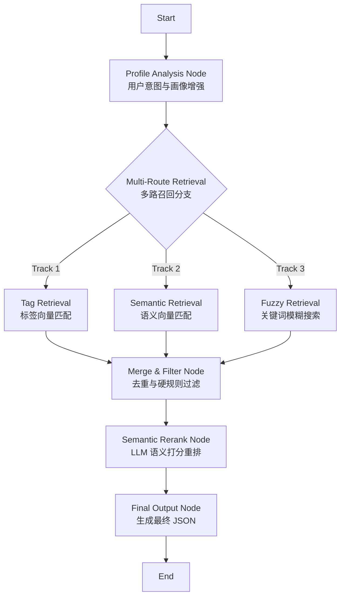

# LangGraph 精准推荐子图 (Precision Recommendation Subgraph) 设计方案

本方案基于《企业需求推荐场景下的 RAG 落地最终方案》文档及现有数据环境设计，旨在将原有的线性推荐流程升级为 **“多路召回 + 语义重排”** 的漏斗型精准推荐系统。

---

## 一、 核心架构设计 (Architecture)

系统采用 `StateGraph` 子图架构，包含 5 个核心节点，遵循 **宽口径召回 -> 硬规则过滤 -> 深度语义重排** 的处理逻辑。

### 流程图



### 核心节点职责

1.  **Profile Analysis Node (画像增强)**: 分析用户输入，提取关键词、Interest/Skill 标签 ID，并生成用户输入的 Embedding 向量。
2.  **Multi-Route Retrieval (多路召回)**:
    *   **Track 1 (Tag)**: 现有逻辑，通过 Milvus 匹配标签 ID，查数据库关联项目。
    *   **Track 2 (Semantic)**: (新增) 通过用户输入向量，查询 Milvus 项目向量库 (需新建)。
    *   **Track 3 (Fuzzy)**: (新增) 通过关键词 SQL `LIKE` 查询项目标题/描述。
3.  **Merge & Filter Node (合并初筛)**: 对三路结果去重，过滤非进行中项目，保留 Top 20-30 进入精排。
4.  **Semantic Rerank Node (语义重排)**: **核心环节**。LLM 阅读候选项目的完整描述，根据“标签匹配度+语义契合度”打分 (0-100)，并生成推荐理由。
5.  **Final Output Node (输出)**: 格式化 Top 5 结果为 JSON，供主 Agent 使用。

---

## 二、 详细状态定义 (State Schema)

在 `student_workflow.py` 中扩展 `AgentState` 或定义新的 Subgraph State。

```python
from typing import TypedDict, List, Dict, Any, Annotated
from langchain_core.messages import BaseMessage
from langgraph.graph.message import add_messages

class RecommendationState(TypedDict):
    # --- 输入数据 ---
    user_input: str
    student_id: int
    
    # --- 过程数据 (Process Data) ---
    # 1. 画像分析结果
    analyzed_tags: Dict[str, List[int]]   # 提取的 Interest/Skill IDs (Track 1)
    analyzed_keywords: List[str]          # 提取的文本关键词 (Track 3)
    search_vectors: List[float]           # 用户输入的文本向量 (Track 2)
    
    # 2. 召回池 (Candidate Pool)
    # 存储格式: {project_id: {data: ProjectDict, source: ["tag", "semantic"]}}
    raw_candidates: Dict[int, Dict]       
    
    # 3. 过滤后列表 (用于重排)
    filtered_projects: List[Dict]         
    
    # 4. 重排后列表 (带分数和理由)
    ranked_projects: List[Dict]           
    
    # --- 输出数据 ---
    profile_data: Dict[str, Any]          # 最终给 Agent A 的 JSON
    messages: Annotated[List[BaseMessage], add_messages] # 思考过程日志流
```

---

## 三、 完整实现步骤 (Implementation Plan)

### 第一阶段：数据与工具准备 (Prerequisites)

为了支持多路召回，需完善底层数据和工具。

1.  **补全向量数据 (针对 Track 2)**
    *   **动作**: 创建新的 Milvus Collection `project_embeddings`。
    *   **脚本**: 编写离线脚本，读取 `project_requirement` 表的 `description` (或 `title` + `description`)，生成向量并存入 Milvus，Metadata 包含 `project_id`。
    
2.  **扩展检索工具 (Tools Expansion)**
    *   修改 `d:\Server_Project_ZH\langchain-v2.0\tools\project_tool.py`:
        *   更新 `get_candidate_projects`: 返回结果必须包含 `description` 字段（重排节点需要阅读）。
        *   新增 `search_projects_fuzzy(keywords)`: SQL `LIKE` 查询。
        *   新增 `search_projects_vector(query_vector)`: Milvus 向量检索。

### 第二阶段：节点逻辑实现 (Node Logic)

1.  **Profile Analysis Node**
    *   并行调用 `extract_keywords` (关键词), `retrieve_tags` (标签ID), Embedding 模型 (向量)。
    *   输出更新 `analyzed_tags`, `analyzed_keywords`, `search_vectors`。

2.  **Retrieval Logic (并行执行)**
    *   **Track 1**: 根据 `analyzed_tags` IDs 查库。
    *   **Track 2**: 根据 `search_vectors` 查 Milvus 项目库。
    *   **Track 3**: 根据 `analyzed_keywords` 查库。
    *   **Merge**: 将所有结果合并到 `raw_candidates`，记录来源。

3.  **Rerank Node (LLM)**
    *   **Prompt**:
        ```text
        用户需求: {user_input}
        
        候选项目列表:
        1. [ID:101] 项目A: 描述... (Tags: Python, AI)
        2. [ID:102] 项目B: 描述... (Tags: Java)
        ...
        
        请为每个项目打分 (0-100) 并给出简短理由。
        评分标准: 标签匹配(40%) + 语义契合(40%) + 关键词命中(20%)。
        输出 JSON: [{ "id": 101, "score": 85, "reason": "..." }, ...]
        ```
    *   取 Top 5 更新 `ranked_projects`。

4.  **Output Node**
    *   将 `ranked_projects` 转换为符合 Agent A 要求的最终 JSON 结构 (`profile_data`)。

---

## 四、 代码重构路线图 (Roadmap)

1.  **Step 1: 状态定义**
    *   在 `student_workflow.py` 中引入新的 `RecommendationState`。

2.  **Step 2: 工具升级**
    *   修改 `project_tool.py`，确保返回 `description`，添加模糊查询工具。

3.  **Step 3: 节点拆分与重写**
    *   将原 `reasoning_node` 拆解为 `analysis_node`, `retrieval_node`, `rerank_node`。

4.  **Step 4: 图构建**
    *   重新定义 `StateGraph` 的边和节点。

5.  **Step 5: 验证**
    *   使用 `interactive_chat.py` 验证召回多样性和推荐理由的准确性。

---

## 五、 关键优势

1.  **解决“零结果”问题**: 即使标签匹配失败，Track 2 (语义) 和 Track 3 (模糊) 也能兜底召回相关项目。
2.  **精准度提升**: 通过 LLM 阅读项目描述进行重排，比单纯的标签匹配更懂“项目内容”。
3.  **可解释性**: 推荐结果带有 LLM 生成的 `match_reason`，让 Agent A 的回复更有说服力。
