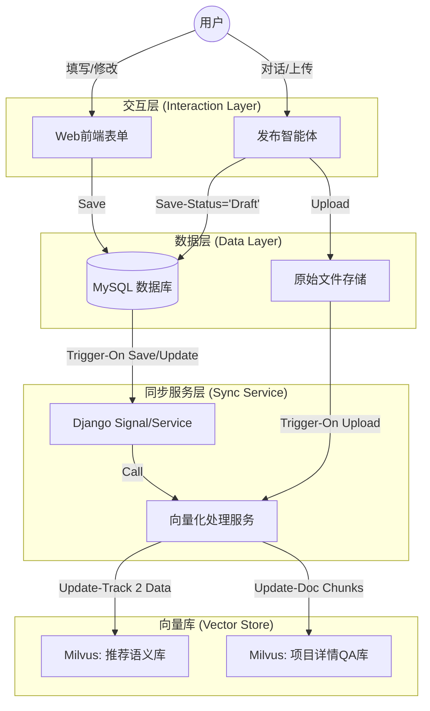

这是一个非常系统且切中痛点的设计需求。你提出的三个“潜在问题”非常关键，它们揭示了**“Agent 只是系统的一个交互入口，而非唯一的数据入口”**这一核心矛盾。

为了解决这些问题，我们需要将 向量化（Vectorization） 和 数据存储（Persistence） 从 Agent 的动作中解耦出来，变成系统底层的 统一服务（Unified Service） 。

以下是针对“企业需求发布智能体”的完整设计方案，重点解决了数据一致性和多端同步的问题。

# 企业需求发布智能体设计方案 (Enterprise Requirement Publishing Agent)
## 一、 核心设计理念：数据一致性优先
针对你提出的 “表单 vs 对话” 和 “草稿修改” 的矛盾，核心解决方案是： 建立统一的“向量同步机制” (Vector Sync Mechanism) 。

无论数据来源是 Agent 对话 还是 Web 表单 ，只要 MySQL 中的核心数据（Title, Description, Requirements）发生变更（且状态为有效时），都统一触发同一个向量化服务更新 Milvus。

### 数据流向架构

## 二、 解决你的三个核心疑惑
### 1. 表单录入无向量数据的问题
方案 ：在 Django 的 Requirement Model 上挂载 post_save 信号（Signal），或者在 views.py 的保存逻辑中显式调用同步服务。

- 逻辑 ：当 Requirement 被保存且 status 变为 in_progress (或 under_review ) 时，后台自动读取 title + description ，调用 Embedding 模型，写入/更新 Milvus 的 project_embeddings 集合（即 Track 2 数据源）。
- 结果 ：无论用户是用 Agent 还是表单，向量库永远与 MySQL 保持一致。
### 2. 纯对话无文件导致缺少 QA 数据的问题
方案 ： “虚拟文件”策略 。

- 如果用户未上传 PDF，Agent 会根据对话生成的结构化总结（JSON），生成一份标准化的 Markdown 文本。
- 我们将这份 Markdown 文本视为“原始文件”，同样经过切片（Splitter）和向量化，存入 project_raw_docs 集合。
- 结果 ：推荐智能体在介绍项目时，如果没 PDF，就检索这份由 Agent 生成的“详尽描述向量”，依然有话可说。
### 3. “草稿 -> 修改 -> 最终发布” 的不一致问题
方案 ： “延迟/触发式”向量化 。

- Agent 阶段 ：Agent 将数据写入 MySQL，状态设为 draft （草稿）。 此时不写入用于推荐的 Milvus 库 （避免推荐未完成的项目）。
- 人工修改阶段 ：用户在 Web 表单修改描述。
- 发布阶段 ：用户点击“发布/提交审核”。此时触发后端逻辑，读取 最终版 的 MySQL 数据生成向量，覆盖写入 Milvus。
- 结果 ：向量库永远反映用户修改后的最终版本。
## 三、 智能体详细设计 (Agent Design)
### 1. 状态定义 (State Schema)
我们需要定义一个包含长期记忆（User Profile）和短期记忆（文件内容、对话上下文）的状态。

```
class PublisherState(TypedDict):
    messages: Annotated[List[BaseMessage], add_messages]
    user_id: int
    org_id: int
    
    # 短期记忆：当前正在处理的需求草稿
    current_draft: Dict[str, Any] = {
        "title": None,
        "description": None,
        "tags": [],
        "file_content_summary": None # 来自文件解析子图
    }
    
    # 状态标记
    has_uploaded_file: bool = False
    is_confirmed: bool = False
```
### 2. 子图：文件解析工作流 (File Parsing Subgraph)
专门处理用户上传的 PDF/Docs，用于辅助 Agent 理解需求，并为未来的 QA 功能做准备。

- Nodes :
  1. Loader Node : 使用 PyPDFLoader 或 UnstructuredWordDocumentLoader 加载文件。
  2. Cleaning Node : 去除页眉页脚、乱码。
  3. Summary Node (for Agent) : LLM 阅读全文（或摘要），提取关键信息（技术栈、研究方向），返回给主 Agent 更新 current_draft 。
  4. Vectorization Node (for Future QA) : 使用 RecursiveCharacterTextSplitter 切块，存入 Milvus project_raw_docs 集合（Metadata 关联 draft_id ）。
### 3. 主图：交互工作流 (Main Graph)
- Nodes :
  1. Chat Node : 负责与用户多轮对话。基于 current_draft 的完整度提问（例如：“我看到了项目背景，但还需要您补充一下具体的人数需求和预算”）。
  2. Draft Update Node : 将用户的回复解析并更新到 current_draft 结构体中。
  3. Review Node : 生成一份完整的“需求预览”，请求用户确认。
  4. Database Write Tool : 用户确认后调用。
### 4. 关键工具 (Tools) 

### Tool A: save_requirement_draft (写入 MySQL)

```
@tool
def save_requirement_draft(title: str, description: str, ...) -> 
str:
    """
    将需求写入 MySQL，状态设为 'draft' (草稿)。
    返回: requirement_id
    """
    # 1. Django ORM 创建记录
    req = Requirement.objects.create(..., status='draft')
    # 2. 如果之前子图解析了文件，关联文件 ID
    return f"草稿已保存，ID: {req.id}。请告知用户可前往工作台确认发布。"
```

### Tool B: trigger_vector_sync (手动触发同步 - 可选)

如果用户在对话中明确表示“不用改了，直接发布”，Agent 可以调用此工具，将状态改为 under_review 并立即触发向量化。

## 四、 针对 Track 2 (Semantic) 的数据构建思路
参考 precision_recommendation_design.md ，Track 2 需要语义向量。

构建逻辑 ：

1. 数据源 ： Requirement.title + Requirement.description + Requirement.tags (Text).
2. 处理时机 ：仅当 Requirement.status 变为有效状态时。
3. Embedding 模型 ： 必须 与 student_workflow.py 中用于处理 user_input 的模型一致（同为 text-embedding-v4 ）。
4. 存储 ：Milvus Collection project_embeddings 。
   - Field: project_id (Int64)
   - Field: vector (FloatVector)
   - Field: text_preview (VarChar) - 用于调试
## 五、 落地执行清单 (Action Items)
为了实现这个方案，我们需要按以下步骤操作。请确认是否需要我开始执行其中的某一部分：

1. 后端改造 (Django) :
   - 在 project/services.py 中编写 sync_requirement_vectors(requirement_id) 函数（核心同步逻辑）。
   - 修改 project/views.py 和 project/models.py ，确保保存时触发该逻辑（或通过 Signal）。
2. 向量库准备 :
   - 创建 Milvus Collection: project_embeddings (用于推荐) 和 project_raw_docs (用于 QA)。
3. Agent 开发 :
   - 编写文件解析子图 ( file_parsing_graph.py )。
   - 编写发布智能体主图 ( publisher_agent.py )。
   建议第一步： 先实现 后端改造 ，因为这是解决你三个“潜在问题”的根基。无论 Agent 何时上线，这一步都能保证现有数据的向量化就绪。